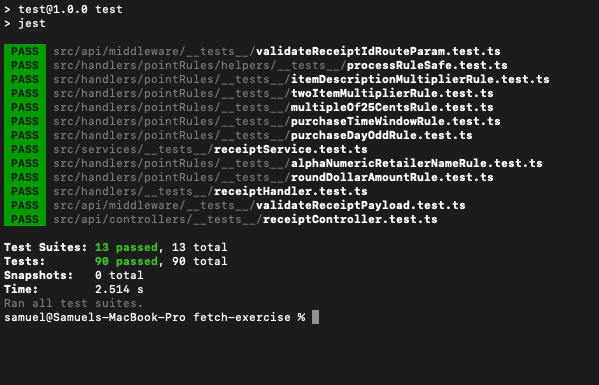
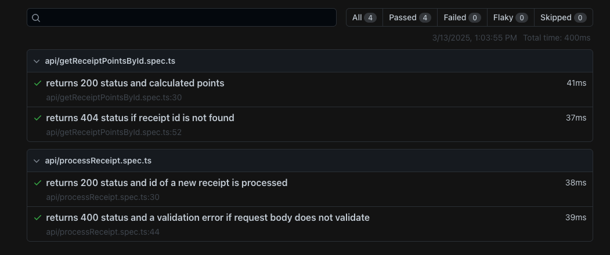

# Fetch Takehome Exercise (Backend)

**Author: Samuel Cicero 👋**

## Running the Application

### Prerequisite

- In order to run this application you need [Docker](https://docs.docker.com/) installed on your machine. All other dependency management should be handled within the docker container itself.

### Install Steps

1. Build the docker image
   - `docker build --no-cache -t fetch-app-sam-cicero .`
2. Run the container and expose port 3001
   - `docker run -it --rm -p 3001:3000 fetch-app-sam-cicero`
3. Access API endpoints with fully qualified routes
   - `http://localhost:3001/receipts/process`

## Project Overview

This project was built using **NodeJS** as well as a few key packages for specific functionality including:

1. [Express](https://expressjs.com/) for API Routing
2. [Joi](https://joi.dev/) for API Validation.
3. [Jest](https://jestjs.io/) for Unit Testing
4. [Playwright](https://playwright.dev/) for End-to-End Testing

## Design Decisions / Assumptions

- Two endpoints defined in the exercise instructions were added to match the .yml openAPI spec
   - `POST receipts/process`
   - `GET receipts/{id}/points`
- One additional API endpoint `GET receipts/78e8db9d-a2ea-4c83-8b01-e647aba1e4c4/` was added to the project to return the full receipt object post processing. This will include the points as well as a convenience.
- Each rule was encapsulated in its own module implementing a `PointRule` interface with a `processRule` function. This allows each rule to be defined in a consistent way as well as allows cleaner testing.
- API payloads and route parameters are using middleware to intercept each request and handle validation appropriately.
- API payload are validated with [Joi](https://joi.dev/) schema for ease of implementation in this exercise, but can also be done manually as an implementation choice.

## Project File Structure

The project is broken up into subfolders and files with a specific organizational pattern as follows:

- `api/`
   - Contains all routes, controller, and middleware responsible for HTTP transactions within the application. By design, this layer is very light and meant as an interface for the API.
- `handlers/`
   - Contains specific modules that handle application business logic including rules and the rule aggregator.
- `services/`
   - Contains shared modules that interact with commom modules such as persistence/cache that can be used in multiple places within the app. For example, multiple handlers may both use `receiptService` to get receipt details
- `helpers/`
   - Common utilites that are shared acrros the application such as logging.

## Testing

### Unit Testing

- All modules are unit tested for both positive and negative test cases when applicable. To run unit tests, you can run the `npm test` command from the root directory of the project. A coverage report is also supplied within the `coverage/` directory within the root of the project

### End-to-End Testing

- A few sanity end-to-end tests have been added to validate that the application is working in runtime. To run e2e tests, you can run the `npm run test:e2e` command from the root directory of the project. A coverage report is also supplied within the `playwright-report/` directory within the root of the project

